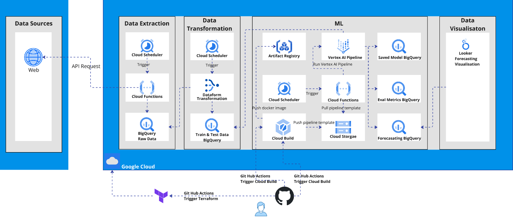
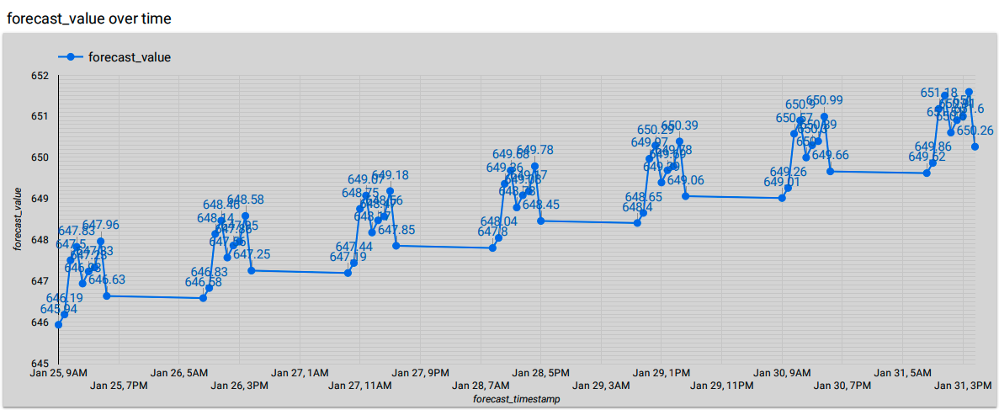

# Forecasting Pipeline

## Overview

This project implements an end to end forecasting pipeline using Google Cloud services, integrating data extraction, transformation, machine learning modeling, and visualisation. The architecture ensures automation and scalability, leveraging GitHub Actions for CI/CD.

## Agile Methodology

*   **Methodology:** Scrum
*   **Project Tool:** GitHub (Issues, Project Boards)
   
## Architecture

The pipeline consists of the following key components:

*   **Data Sources**
    *   Data is fetched from a web API.

*   **Data Extraction**
    *   Cloud Scheduler triggers data extraction.
    *   Cloud Functions process and store raw data in BigQuery.

*   **Data Transformation**
    *   Cloud Scheduler triggers data transformation.
    *   Dataform processes and transforms the data.
    *   Processed data is stored in BigQuery for training and testing.

*   **Machine Learning (ML) Pipeline**
    *   Cloud Build pushes the pipeline template and Docker image.
    *   Artifact Registry stores model artifacts.
    *   Vertex AI Pipeline runs the ML workflow.
    *   Cloud Scheduler triggers cloud functions manage pipeline execution.
    *   Model outcomes are stored in BigQuery for evaluation and forecasting.

*   **Data Visualization**
    *   Forecasting results are visualised using Looker.

*   **CI/CD Automation**
    *   GitHub Actions trigger Terraform for infrastructure deployment.
    *   GitHub Actions trigger Cloud Build for container and ML pipeline execution.

## Forecast Outcome

The forecasting results are visualised over time, showing incremental trends in forecasted values. The visualisation demonstrates:

*   Forecast values improving over time.
*   Stepwise increments indicating periodic model updates.
*   Data consistency and accuracy in prediction.

## Technologies Used

*   **Methodology:** Scrum
*   **Project Tool:** GitHub (Issues, Project Boards)
*   **Google Cloud Services:** Cloud Scheduler, Cloud Functions, BigQuery, Cloud Build, Artifact Registry, Cloud Storage, Vertex AI
*   **Data Processing:** Dataform
*   **CI/CD:** GitHub Actions, Terraform
*   **Visualization:** Looker